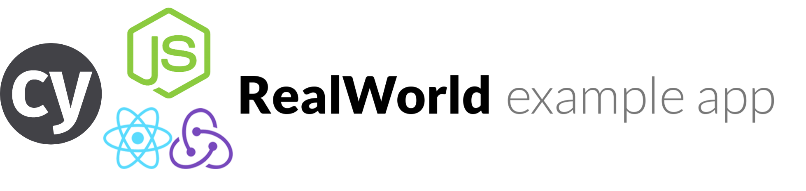

# Cypress-example-realworld
*a full stack example of Cypress use cases and best practices*


[](https://circleci.com/gh/cypress-io/cypress-example-realworld)

Run api tests:
```
npm run server:test
```

Start server:
```
npm run server:start
```

Start client:
```
npm start
```

JSON database writes to `server/data/db.json`

